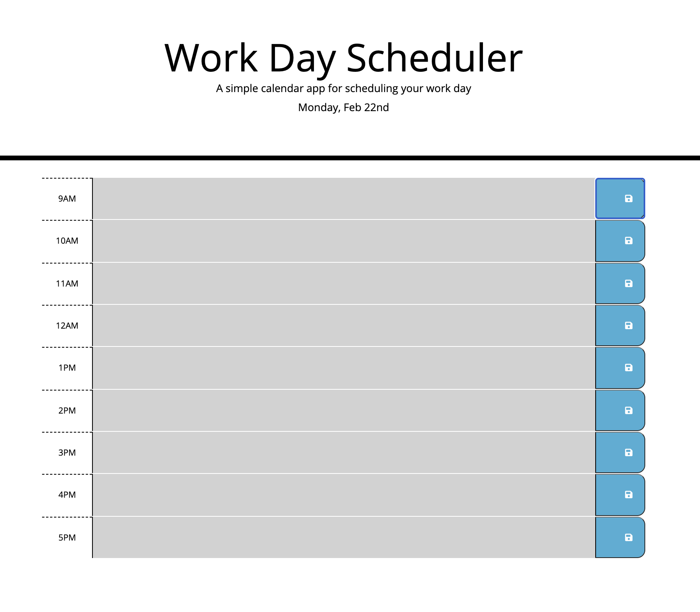

# Work Day Scheduler ("work-day-scheduler")

## Table of Contents

* [Description](#description)
* [Requirements](#requirements)
* [Installation](#installation)
* [Contributing](#contributing)
* [Credits](#credits)

## Description
---
This repository ("work-day-scheduler") uses HTML, CSS, and jQuery to create a calendar application 
that allows users to save events for each hour of a 9 to 5 work day. It also uses the Moment.js library to work with date and time. 

Deployed Website: https://smoyamendez.github.io/work-day-scheduler/



## Requirements 
---
```
GIVEN I am using a daily planner to create a schedule
WHEN I open the planner
THEN the current day is displayed at the top of the calendar
WHEN I scroll down
THEN I am presented with timeblocks for standard business hours
WHEN I view the timeblocks for that day
THEN each timeblock is color coded to indicate whether it is in the past, present, or future
WHEN I click into a timeblock
THEN I can enter an event
WHEN I click the save button for that timeblock
THEN the text for that event is saved in local storage
WHEN I refresh the page
THEN the saved events persist
```

## Installation
---
No need for any installation for this project.

See deployed site here: https://smoyamendez.github.io/work-day-scheduler/

See repository here: https://github.com/smoyamendez/work-day-scheduler

## Contributing
---

Please review and let me know if you see any ways this code can be improved.

Email: smoyamendez@gmail.com

## Credits
---
Thank you to Trilogy Education Services, LLC for providing the original code.